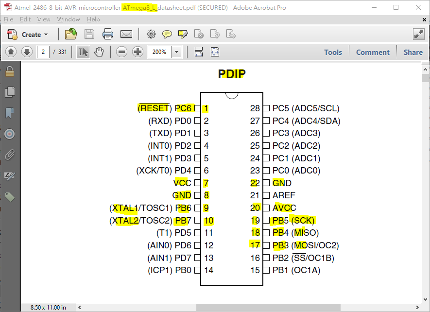

# AVR_ISP_PIN   
AVR MCU, ISP pin# table, easy design aid   
by xiaolaba, last edit 2014-06-22   
[PNG/ATMEGA2560_ISP_PIN.PNG](PNG/ATMEGA2560_ISP_PIN.PNG)  
   
[ PNG/ATMEGA328_ISP_PIN.PNG ]  ( PNG/ATMEGA328_ISP_PIN.PNG )  
   
[ PNG/ATMEGA8_ISP_PIN.PNG ]  ( PNG/ATMEGA8_ISP_PIN.PNG )  
   
[ PNG/ATTINY13_ISP_PIN.PNG ]  ( PNG/ATTINY13_ISP_PIN.PNG )  
   
[ PNG/ATTINY2313_ISP_PIN.PNG ]  ( PNG/ATTINY2313_ISP_PIN.PNG )  
   
[ PNG/ATTINY24_ISP_PIN.PNG ]  ( PNG/ATTINY24_ISP_PIN.PNG )  
   
[ PNG/ATTINY26_ISP_PIN.PNG ]  ( PNG/ATTINY26_ISP_PIN.PNG )  
   
[ PNG/ATTINY45_ISP_PIN.PNG ]  ( PNG/ATTINY45_ISP_PIN.PNG )  
   

